> 本文将不定期补充 ffmpeg 其余压制方案或者命令行使用方法

**如果有在 Mac 下压制字幕需求的话，可以直接在 Mac App Store 搜索 [PineconeSuppress](https://apps.apple.com/cn/app/pineconesuppress/id1398134175?l=en&mt=12)。我将 ffmpeg 进行了可视化的封装，可以更加轻松的在 Mac 下压制字幕哦~**

这篇博客要感谢蒸包同志！没有蒸包同志的教学就没有这篇博客的输出。以及，要说难确实也有点难度，要说不难，我真的很努力写的白话文加配图了。以及如果需求大我会开发 Mac 可视化版本的压制软件...这是后话。

## 问题

大部分字幕组做视频压制，标准配备都是 Windows 版本的小丸工具箱。但是小丸工具箱的 Mac 版本没有 Windows 那么好。其次的问题是怎么 Mac 怎么打 logo。在我们组内使用 Aegisub 打 logo。使用 Aegisub 打 logo 的话，需要给 Aegisub 安装 vsflitermod 插件，这玩意没有 Mac 的。最后的问题是，Mac 下没有好的压制工具。

## 工具问题

小丸实际上是针对 ffmpeg 进行了图像化的封装。那么原理上我们只要会 ffmpeg 就可以在 Mac 上达到相同的功能。而 Mac 下没有很好的 ffmpeg 的图形化客户端。那没办法，只有用命令行了。（如果需求量大我考虑下自己开发一个图形化的，但是目前还不会）

## 预备

首先需要下载一个 ffmpeg 在 Mac 下的可执行文件。[https://evermeet.cx/ffmpeg/](https://evermeet.cx/ffmpeg/) 这个是 ffmpeg 官网跳转的链接。下载右下角的（其实都可以）。

之后解压缩文件，会得到一个下图这样黑黑的东西。

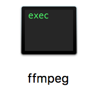

我的建议是建一个单独的文件夹。把这个 ffmpeg 放进去。然后的话就需要一点点计算机的知识了...没有很难，我也会尽量阐述的可以理解一点，而且全部配图。我也基本保证就这一点点专业性的东西。

首先在电脑里找到 Terminal。

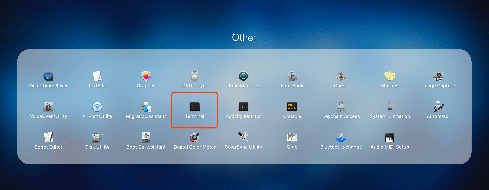

这时候要看下 ffmpeg 在哪个文件夹，比如我的 ffmpeg 在 Document 下的 ffmpeg 里。那么就输入命令，`cd Documents/ffmpeg/`。cd 的意思就是进入某个文件夹的意思。我们这里就是进入了 ffmpeg 的文件夹

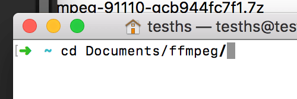

这个时候再输入一个命令 `ls`。ls 的意思是显示这个文件夹下所有的文件。可以看我的配图。到这步在 Terminal 看到有 ffmpeg 就可以了。然后点这个 [render.sh](images/ffmpeg/render.sh)网页，就会自动下载一个文件，将这个文件放到和 ffmpeg 一个文件夹就可以啦。如下图。

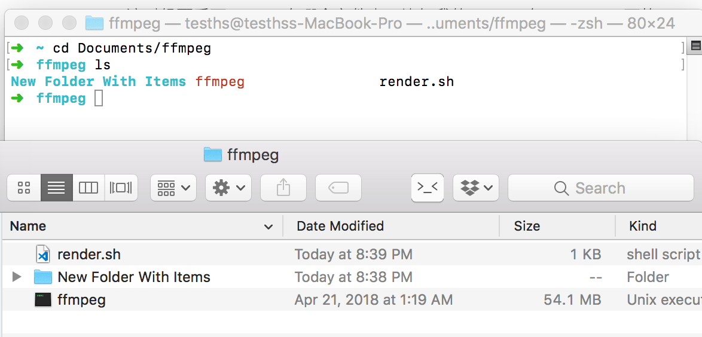

## 使用

使用方案，需要用哪一个方法，就把最前面的 # 号去掉。中文那行不能注释。**以及记得把视频 ass 还有 logo 的图都和那个黑色的 ffmpeg 放在一起。**下文有详细图。

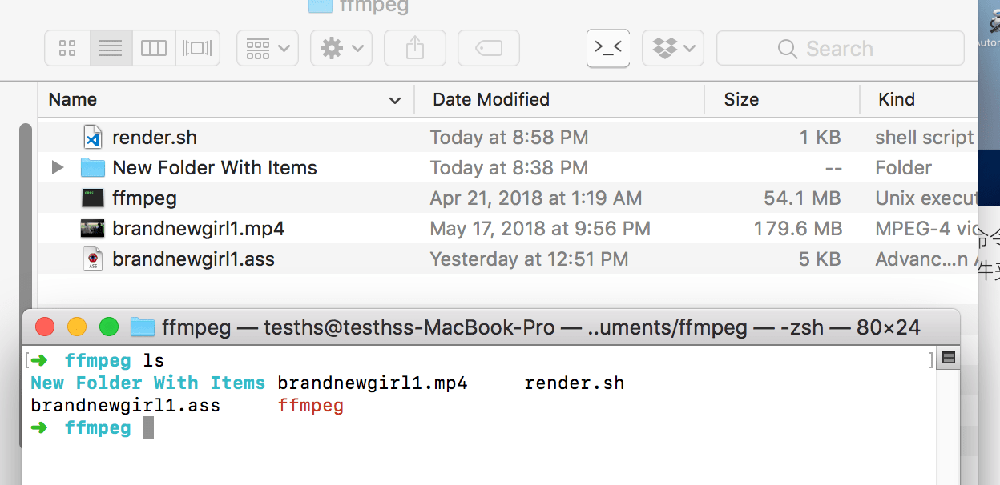

把需要的方案注释之后，在 Terminal 里运行 `bash render.sh`。就会开始压制了。

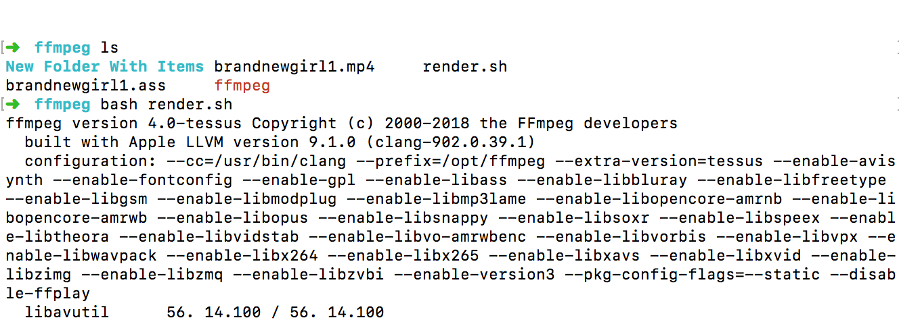

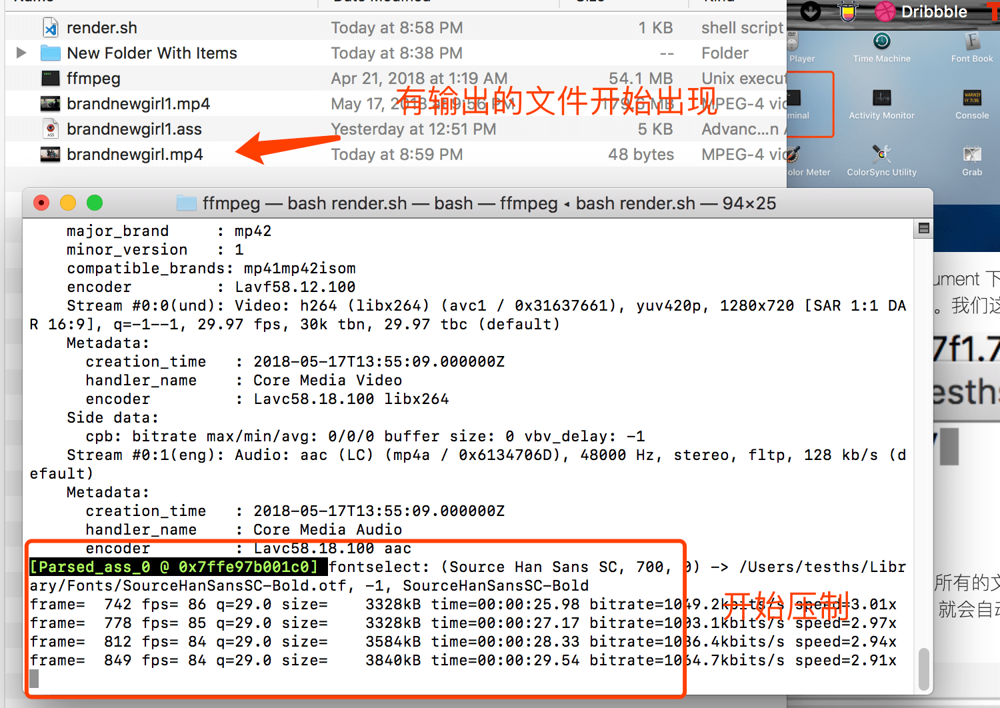
render.sh 里定义了几个方法。

**1.转换视频格式**

把 in 改成你的视频名字，out 改成输出的视频名称即可。

比如我想把 wake.mp4 换成 mkv。就改为。

`./ffmpeg -i "wake1.mp4" wake.mkv`

**2.压制 srt 字幕**

把 in.mp4 换成你的 mp4，把 xx.srt 换成你的 srt 文件，out.mp4 换成你需要的名字。

**3.压制 ass 字幕**

把 in.mp4 换成你的 mp4

把 xx.srt 换成你的 ass 文件

out.mp4 换成你需要的名字。如下图。

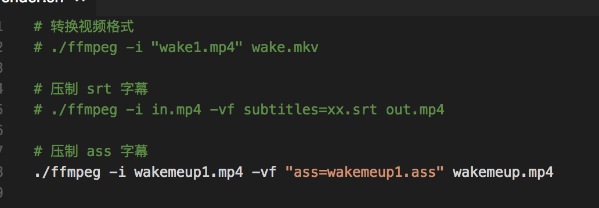

压制完成后就会是。

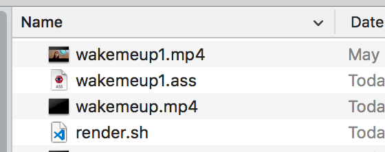

**4.压制带 logo 的（logo 在上 ass 字幕在下）**

**这里的 logo 在上 ass 在下，是指如果 logo 和滚轴重复在一起，哪一个在上面。**下文有反着的。

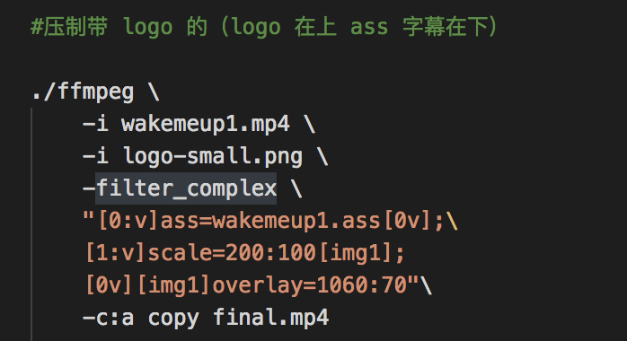

由于我上文提到的，Mac 下的 Aegisub 插件是没有的，那我们可以利用 ffmpeg 来压制。将 logo 文件放在 ffmpeg 文件夹下。

wakemeup1.mp4 换成你的 mp4 文件名

logo-small.png 换成你的 logo 图片

wakemeup1.ass 换成你的 ass 文件

overlay=1060:70 这里的 1060:70 是距离屏幕左边 1060 的位置，距离屏幕上面 70 的位置。可以在 Aegisub 确定好在填写。可以参考 [如何在ASS字幕中插入各种图片](http://tieba.baidu.com/p/2706704635)，里面的 `{\p1\1img\bord0\shad0\(logo-small.png\pos(1123,166.99)}m 0 0 l 0 120 l 240 120 l 240 0` 方案。先确定 logo 位置，填写到这里。

直接在 Aegisub 上比对下也行。

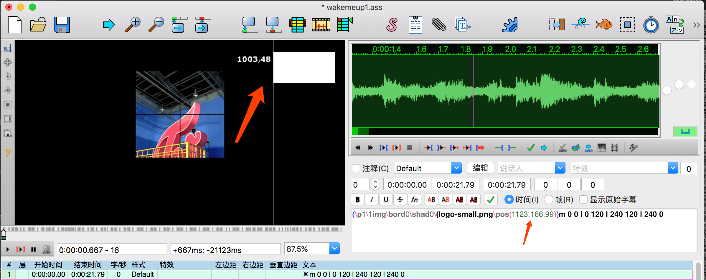

**5.压制带 logo 的（ass 字幕在上 logo 在下）**

同上。

**6.压制延迟出现 logo 的**

大部分同上。

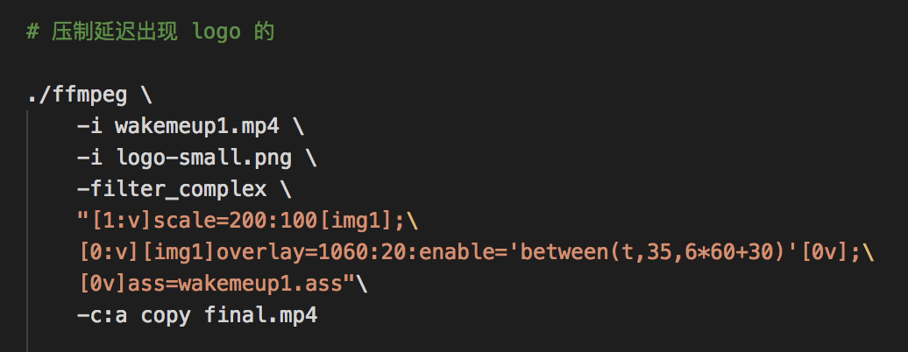

出现时间修改。

`enable='between(t,35,6*60+30)'`

我现在想从第 10 秒到最后，假设影片长度 120 秒。那么修改 为 `enable='between(t,10,120)'`。即修改两个数字即可。

总结一下就是。准备需要的 mp4，ass，logo，然后修改 render.sh 文件。以及在 Terminal 运行 `bash render.sh`

## 注意事项

1. render.sh 文件中如果多行的话，多行都需要注释，如我的图。
2. 需要使用哪个则把前面的 # 去掉，其他的还得用 # 弄上。
3. 如果使用中遇到错误请发邮件给我，虽然我不一定可以解决，但是可以试试看。邮箱是 tesths@yahoo.com。
4. 如果你有更好的方案也欢迎留言或者给我发邮件。
5. 以及有什么不明白的，留言和发邮件都可以。
6. 以及这一套是可以完全用在 Windows 上的。
7. 以上。

